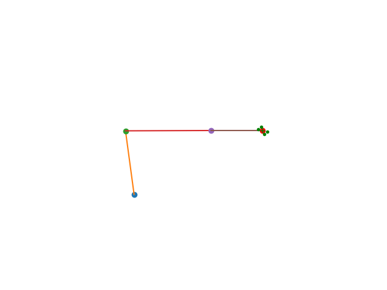

# Visual Tracking of a Robotic Arm

Tested with Python3.5

## Goal
Given a camera adapted on the robot's effector, track a moving object (rectangle) so as both relative angle and position remain constant.

## Solution
We design a control law that ensures minimum error between the measured and the desired angle and position.

## Results

